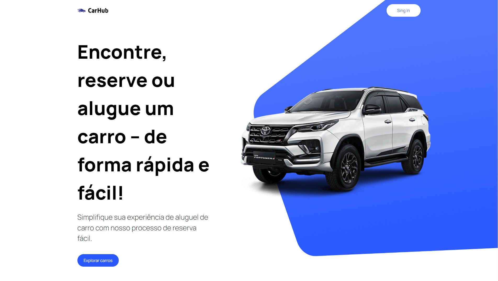
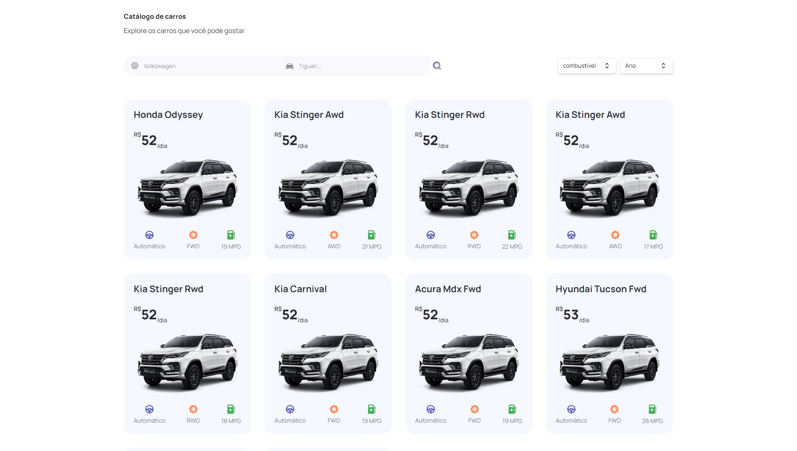
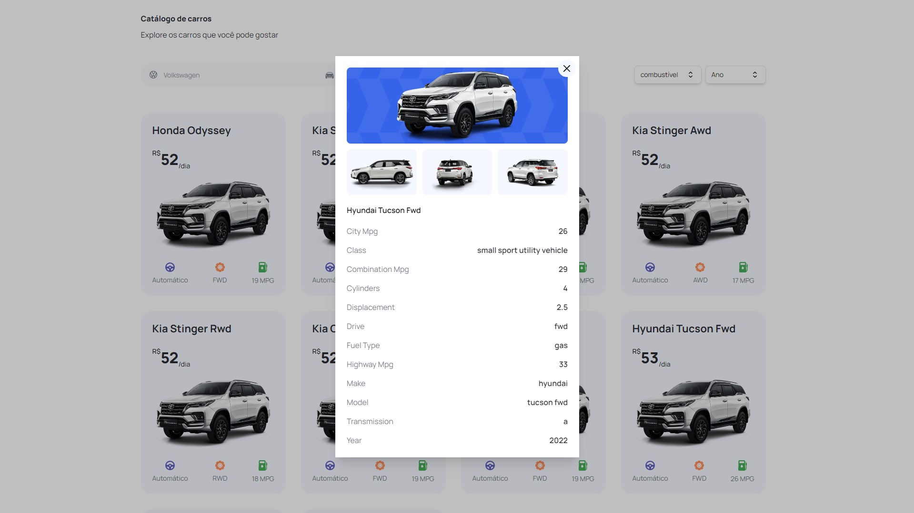
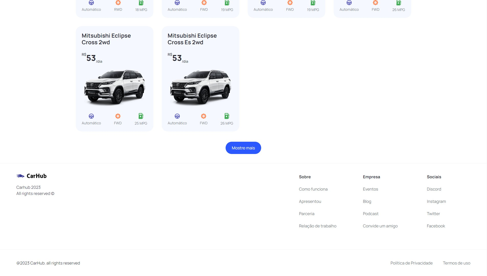

<h1 align="center"><a href="https://car-showcase-cl57.vercel.app/" target="_blank" rel="noopener noreferrer">CarHub</a></h1>
 

     

   
<h2>Projeto</h2>

CarHub é um projeto usando React mais especificamente Next JS com com objetivo de simular uma locadora de carros.

   

     

  

     

  

Neste projeto foi utilizado a API RapidAPI Cars para gerar os diversos tipos de carros e consultar as suas características.

   

     

<h2>Tecnologias</h2>
<ul>
   <li>React</li>
   <li>TypeScript</li>
   <li>tailwind</li>
   <li>frameworks</li>
</ul>
